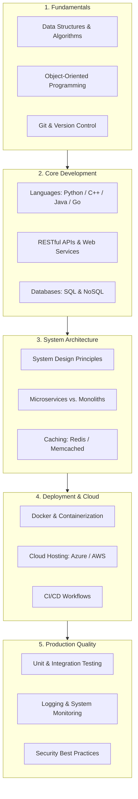
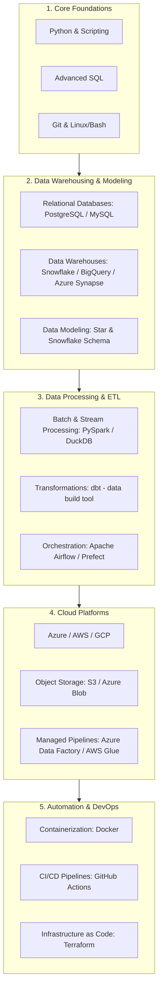
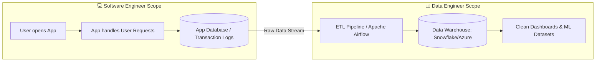

# 🧭 Software Engineering vs. Data Engineering: Technical Roadmaps & Architecture

Understanding the distinction, progression, and operational hand-off between **Software Engineering** and **Data Engineering** is essential for building scalable modern technical systems. This guide provides a structured breakdown of key technologies, individual career roadmaps, and the unified enterprise workflow.

---

## 💻 1. Software Engineering Overview & Roadmap

Software Engineers design, construct, and maintain application logic, API layers, microservices, and user-facing platforms.

* **Core Pillars:** Data Structures & Algorithms, Object-Oriented Programming, API Design, Microservices, and Cloud Deployment.
* **Primary Output:** Reliable software products, microservices, and live transactional databases.

## 📊 2. Data Engineering Overview & Roadmap

Data Engineers build and optimize automated infrastructure to convert raw, unstructured data streams into highly structured, analytics-ready environments.

* **Core Pillars:** Advanced SQL, Data Modeling, Pipeline Orchestration (Airflow/dbt), Cloud Warehousing (Snowflake/Azure), and Distributed Computing (Spark).
* **Primary Output:** Scalable ETL/ELT pipelines, data warehouses, and analytics-ready datasets.

## 🔄 3. Enterprise Integration: How They Work Together
Software Engineers manage application interaction and record raw data, while Data Engineers build automated pipelines to clean, store, and optimize that data for enterprise decision-making.

## The Data Lifecycle
* **Software Engineering Scope (Production App):** Software Engineers build the core application features, handle live user requests, and write transactional data into live application databases (e.g., PostgreSQL, MongoDB).

* **The Hand-off (Raw Data Stream):** As users interact with the software, transactional logs and raw data are streamed continuously out of the primary application database.

* **Data Engineering Scope (Analytics Infrastructure):** Data Engineers consume this raw data stream using orchestration tools (like Apache Airflow) to extract, transform, and load (ETL) the data into cloud warehouses (Snowflake/Azure).

* **Value Delivery:** Clean, structured datasets are then served for Power BI dashboards, enterprise analytics, and Machine Learning models.
  
  ## Unified Architectural Workflow

